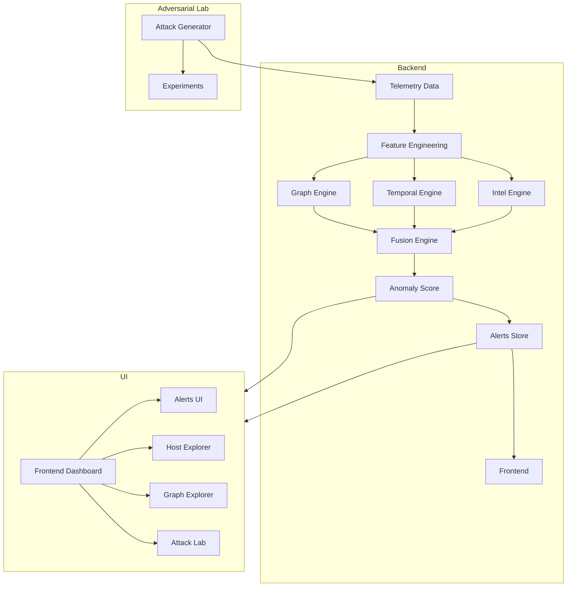
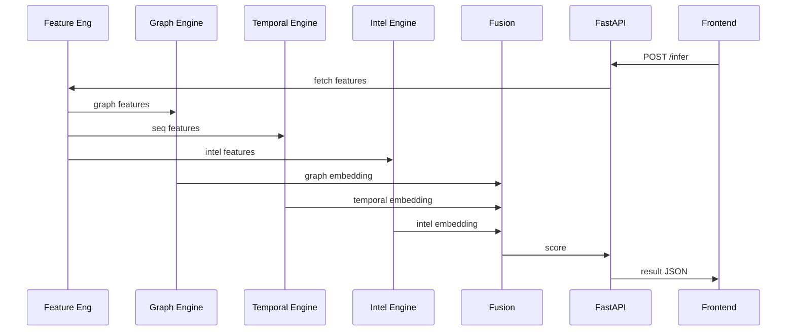

# 📘 HB-IDS v2 — Documentation & Architecture

---

## 🪧 Project Overview

**HB-IDS v2** is a next-generation intrusion detection framework that combines:

✔ Temporal behavioral modeling
✔ Graph relational representation
✔ Threat Intelligence enrichment
✔ Adversarial attack simulation
✔ Robust hybrid anomaly detection
✔ Real-time inference APIs
✔ Frontend dashboard & SOC-style UI
✔ Modular DevOps & CI/CD integration

The system is optimized for:

* **Intel i7 12th Gen**
* **32GB RAM**
* **6GB VRAM**

but remains scalable to cloud infrastructure.

It supports both **fast/demo mode** and a **full hybrid mode**.

---

## 📈 Project Evolution

HB-IDS began as a lightweight behavioral anomaly detector (**V1**) using Isolation Forest and tabular feature modeling. It serves as our **Research Baseline** and **Academic Experiment** version.

**V2** extends this foundations into a production-ready hybrid IDS framework by integrating:

* Rule-based detection
* Drift-aware anomaly validation
* Adversarial resilience testing
* Full observability stack (Prometheus/Grafana/Kibana)
* Real-time React-based SOC dashboards

V1 remains fully available in the `/V1` directory as a baseline reference and a lightweight demo mode for low-resource environments.

---

## 📦 Repository Structure

```
HB-IDS/
│
├── V1/                                   # Legacy baseline
│
├── backend/                              # Backend API + models
│   ├── api/                              # FastAPI endpoints
│   ├── core/                             # Shared logic
│   ├── graph_engine/                     # Graph building & embeddings
│   ├── temporal_engine/                  # Temporal model (TCN)
│   ├── intel_engine/                     # Threat intel vectorization
│   ├── fusion_engine/                    # Final fusion model
│   ├── adversarial_lab/                  # Attack simulators
│   ├── evaluation/                       # Metrics & experiments
│   ├── worker/                           # Background jobs (training)
│   ├── db/                               # ORM models
│   └── utils/                            # Explainability, helpers
│
├── frontend/                             # UI (React + Tailwind)
│
├── configs/                              # YAML config files
│
├── scripts/                              # Run & setup scripts
├── examples/                             # Sample datasets
├── notebooks/                            # Demo notebooks
├── monitoring/                           # Grafana & metrics
├── k8s/                                  # Kubernetes manifests
├── .github/workflows/                    # CI/CD
├── docker-compose.yml
├── Makefile
└── README.md
```

---

## 🎯 Project Goals

1. **Baseline detection (v1)**
   – Isolation Forest / LightGBM
   – Feature-based anomaly detection

2. **Hybrid detection (v2)**
   – GraphSAGE (relational)
   – Temporal Convolutional Networks
   – Intel MLP fusion
   – Node2Vec (demo/fast mode)

3. **Adversarial Framework**
   – Simulate attacks
   – Evaluate defense robustness

4. **Deployment & DevOps**
   – Docker & Kubernetes
   – Monitoring & CI/CD
   – Backend APIs & frontend dashboard

---

## 🏛 Core Components

### 🧠 1. Feature Engineering

Per-window aggregation of:

* bytes_in, bytes_out
* conn_count
* DNS entropy
* NXDOMAIN rate
* failed authentication events
* port diversity

These features go into both temporal and graph pipelines.

---

# ⚙️ 2. Graph Engine

* Builds relational graph: IP ↔ IP, IP ↔ domain, host ↔ CVE
* Node2Vec for fast embedding demo mode
* GraphSAGE for full relational modeling
* Neighbor sampling, dropout regularization

---

## 🕒 3. Temporal Engine

TCN (Temporal Convolutional Network):

– 3 residual blocks
– Channels = 32
– Sequence window length configurable

Purpose: capture periodicity, burst patterns, slow beaconing.

---

## 🛡 4. Threat Intel Engine

Simple MLP encoder for:

* CVSS
* Exploit maturity
* Reputation score
* FortiGuard-like flags
* vulnerability score

---

## 🧩 5. Fusion Engine

Concatenates:

```
[Graph embedding | Temporal embedding | Intel embedding]
```

→ passes through a small fusion MLP
→ outputs final anomaly risk score

Supports:

* Demo (node2vec + LightGBM)
* Full hybrid mode

---

## 🧨 6. Adversarial Lab

Attack scenarios:

| Attack               | Module                                  |
| -------------------- | --------------------------------------- |
| DNS Tunneling        | adversarial_lab/dns_tunneling.py        |
| Lateral movement     | adversarial_lab/lateral_movement.py     |
| Graph Poisoning      | adversarial_lab/graph_poisoning.py      |
| Slow beacon evasion  | adversarial_lab/beacon_evasion.py       |
| Feature perturbation | adversarial_lab/feature_perturbation.py |

Each writes synthetic traffic into DB and runs evaluation pipeline.

---

## 📊 7. Evaluation & Experiments

* Precision@K
* PR-AUC
* Detection Delay
* Attack Success Rate
* Embedding Drift Norm

Experiments folder stores:

```
experiments/run_001/
    metrics.json
    drift_plot.png
    roc_curve.png
```

---

## 🌐 8. Backend (FastAPI)

### Key API Endpoints

| PATH                 | METHOD | DESCRIPTION            |
| -------------------- | ------ | ---------------------- |
| /api/v2/infer        | POST   | Real-time inference    |
| /api/v2/train        | POST   | Trigger training       |
| /api/v2/graph/update | POST   | Update graph           |
| /api/v2/alerts       | GET    | Paginated alerts       |
| /api/v2/redteam/run  | POST   | Launch attack scenario |
| /api/v2/experiments  | GET    | Get experiment results |

Auth via JWT roles:
admin, red_team, blue_team, viewer

---

## 🖥 Frontend Dashboard

Built with:

* React (Vite)
* TypeScript
* TailwindCSS
* Cytoscape / vis-network for graph

### UI Sections

* Overview KPI dashboard
* Hosts table
* Host detail charts
* Graph Explorer
* Alerts list
* Attack Lab
* Experiments
* Settings

---

## 🐳 DevOps & Deployment

### Docker Compose

Running locally:

```
docker compose up
```

Services:

* api
* worker
* postgres
* redis
* grafana
* prometheus
* frontend

---

### Kubernetes Supported

Contains:

* Deployments
* Services
* ConfigMaps
* Secrets

Production manifests in k8s/

---

## 📈 Monitoring & Observability

Prometheus metrics exported:

* inference_time_ms
* train_time
* queue_depth
* GPU_usage
* embedding_drift

Included Grafana dashboards:

```
monitoring/dashboards/
```

---

## 🧪 Tests & CI

* pytest for backend modules
* e2e test for inference + alerts
* CI: GitHub Actions builds + tests + container checks

---

## 🧠 Mode Options

### Fast Demo Mode

```
--mode fast
```

Uses:

* Node2Vec + LightGBM
* Small TCN

### Full Hybrid Mode

```
--mode hybrid
```

Uses:

* GraphSAGE + TCN + Intel + Fusion MLP

---

## 📚 Quick Start

1. Clone repo
2. Install Docker & Docker Compose V2
3. Run `./scripts/dev_setup.sh`
4. Run `./scripts/dev_run.sh`
5. Visit:

   * API docs: [http://localhost:8000/docs](http://localhost:8000/docs)
   * Frontend: [http://localhost:3000](http://localhost:3000)

---

## 🌐 Architecture Diagrams

### Global System Overview (Mermaid)



---

### Detailed Data Flow



---
