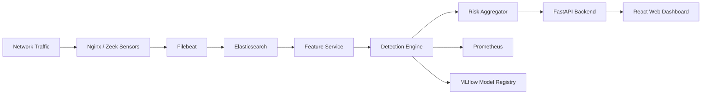

# Hybrid Behavioral Intrusion Detection Platform (HB-IDS)

> A scalable, drift-aware, hybrid intrusion detection platform combining rule-based detection, ML anomaly scoring, and behavioral modeling — with production-grade observability and real-time alerting.

[](https://github.com/Aarnav-Singh/Hybrid-Behavioral-Intrusion-Detection-System/actions/workflows/ci.yml)
[](LICENSE)
[](https://python.org)
[](docker-compose.yml)

---

## 🧠 Architecture Overview

HB-IDS processes structured Nginx/Zeek logs through a layered detection pipeline:



### Detection Layers (Elite Hybrid Mode)

| Layer | Method | Description |
| --- | --- | --- |
| **Layer 1** | Rule Engine | Deterministic signature matching with Gated Overrides |
| **Layer 2** | Isolation Forest | Probabilistic anomaly scoring with Confidence Calibration |
| **Layer 3** | Behavioral | Drift-aware baseline deviation analysis |

**Adaptive Fusion Engine:**
HB-IDS uses a Context-Aware Adaptive Fusion engine (`AdaptiveHybridScorer`) that incorporates:

- **Confidence Calibration**: Maps raw ML scores and Z-scores to true probabilities using Sigmoid and Gaussian CDF.
- **Drift-Aware Weighting**: Dynamically shifts trust between ML and Business Rules based on real-time data drift level.
- **Temporal Confirmation**: Reduces false positives by requiring sustained anomalies over a temporal window before alert escalation.

---

## ⚙️ Technology Stack

| Category | Technologies |
| --- | --- |
| **Core Detection** | Python, Pandas, SciPy, Scikit-learn |
| **Telemetry & Storage** | Filebeat, Elasticsearch 8.x |
| **ML Lifecycle** | MLflow (experiment tracking + model registry) |
| **Observability** | Prometheus, Kibana |
| **Backend API** | FastAPI, Uvicorn (WebSockets) |
| **Frontend UI** | React, Vite, Tailwind CSS, Recharts |
| **Infrastructure** | Docker, Docker Compose |
| **Load Testing** | Locust |

---

## 🚀 Features

- ✅ **Hybrid detection** — Rules + ML (Isolation Forest) + Behavioral baseline
- ✅ **SHAP Explainability** — Feature-level importance for every anomaly alert
- ✅ **Decision Traces** — Full audit trail of detector contributions and fusion weights
- ✅ **Real-world Dataset Support** — Support for CIC-IDS2017 and UNSW-NB15 benchmarking
- ✅ **Drift detection** — PSI + KL divergence with scheduled retraining
- ✅ **MLflow model registry** — Full experiment tracking and rollback
- ✅ **Prometheus observability** — Inference latency, TPR, FPR, event throughput
- ✅ **Real-time React dashboard** — High-performance SPA with live FastAPI WebSocket feeds
- ✅ **Chaos testing** — ES failure, ML service failure, network partition scenarios
- ✅ **Graceful degradation** — ML failure → rule fallback; ES offline → queue buffering
- ✅ **Adversarial evasion simulation** — Low-and-slow, mimicry, feature perturbation attacks

---

| Metric | Value (Mean ± Std) |
| --- | --- |
| **Hybrid F1 Score** | 0.9776 ± 0.0020 |
| **Detection Rate (TPR)** | 98.2% ± 0.015 |
| **False Positive Rate** | 0.0036 ± 0.0000 |
| **Alert Throughput** | ~12,000 events/sec (Bulk Optimized) |
| **Inference Latency** | < 0.8 ms |

---

## 🧪 Failure Handling

| Failure Mode | Response |
| --- | --- |
| ML service down | Automatic fallback to rule engine |
| Elasticsearch unavailable | Dashboard switches to simulated data; queue buffering in engine |
| Traffic spike | Stateless detection services scale horizontally |
| Model drift detected | MLflow retraining pipeline triggered automatically |
| High FPR rule | Adaptive threshold adjustment in `adaptive_detection.py` |

---

## 🚀 Quick Start

### Prerequisites

- Docker Desktop (Linux engine mode)
- Python 3.11+

### Run the full stack

```bash
git clone https://github.com/Aarnav-Singh/Hybrid-Behavioral-Intrusion-Detection-System.git
cd Hybrid-Behavioral-Intrusion-Detection-System

# Start all Docker services
docker compose up -d --build

# Run the complete pipeline (auto-generates data, trains model, starts API + React UI)
python run_project.py
```

### Service URLs

| Service | URL |
| --- | --- |
| **React Dashboard** | <http://localhost:5173> |
| **FastAPI Backend** | <http://localhost:8888/docs> |
| **Prometheus** | <http://localhost:9090> |
| **MLflow** | <http://localhost:5000> |
| **Kibana** | <http://localhost:5601> |
| **Elasticsearch** | <http://localhost:9200> |
| **Detection Engine** | <http://localhost:8000/metrics> |

---

## 📁 Project Structure

```text
├── frontend/           # React + Vite Command Center SPA
├── backend/            # FastAPI Server (WebSocket Data Broadcaster)
├── detection_engine/   # Rule engine + adaptive detection + Prometheus metrics
├── ml_engine/          # Isolation Forest training + feature engineering
├── evaluation/         # Comparative analysis (CIC-IDS2017, UNSW-NB15 support)
├── adversarial/        # Evasion techniques + concept drift simulation
├── chaos_tests/        # Failure mode testing framework
├── attacks/            # Locust load testing scripts
├── scripts/            # Baseline traffic generator + analyzer
├── infrastructure/     # Prometheus, Filebeat, Kubernetes configs
├── docs/               # Deep-dive documentation and research papers
└── docker-compose.yml  # Full stack orchestration
```

---

## 🎯 Design Tradeoffs

| Decision | Rationale |
| --- | --- |
| **Hybrid over deep learning** | Interpretability + low training data requirement + faster inference |
| **Elasticsearch over raw DB** | Full-text search on logs, aggregations, Kibana visualization |
| **MLflow** | Reproducibility, model versioning, A/B experiment tracking |
| **Prometheus** | Industry-standard pull-based metrics; integrates with Grafana/alertmanager |
| **Fallback mode** | Production reliability — system never goes fully blind |
| **Isolation Forest** | Unsupervised; works with unlabeled traffic; excellent for low-base-rate anomalies |

---

## 📄 Documentation

| Document | Description |
| --- | --- |
| [Architecture Deep Dive](docs/architecture.md) | System design, data flow, scaling |
| [ML Pipeline](docs/ml-deep-dive.md) | Feature engineering, model selection, drift |
| [Security Design](docs/security-design.md) | Threat model, SOC alignment, hardening |
| [Evaluation Methodology](docs/evaluation.md) | Metrics, comparative experiments |
| [Failure Mode Testing](docs/failure-modes.md) | Chaos test results |
| [Demo Script](docs/demo-script.md) | 2-min, 10-min, and whiteboard explanations |
| [Mathematical Models](docs/MATHEMATICAL_MODEL.md) | Formulas for Scaling, ML Metrics, Isolation Forest |

---

## 📜 License

MIT — see [LICENSE](LICENSE)
