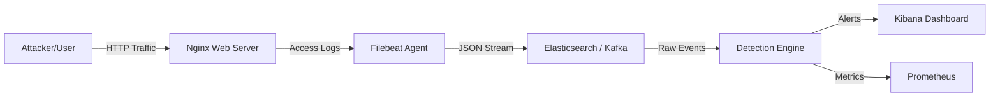
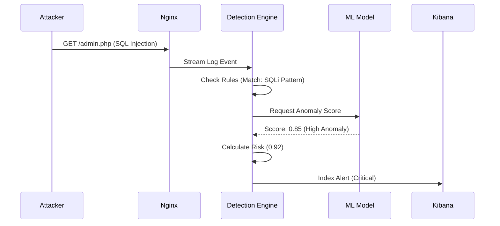

# Application Flow Documentation

## 1. High-Level Data Flow

The Hybrid IDS processes data through a multi-stage pipeline, ensuring that every event is captured, normalized, analyzed, and acted upon.

## 2. Detailed Pipeline Steps

### Step 1: Traffic Generation & Logging

- **Source:** External traffic hits the **Nginx** web server.
- **Action:** Nginx records every request in a structured JSON format to `access.log`.
- **Data Captured:** Timestamp, Source IP, Request URI, User Agent, Status Code, Bytes Sent.

### Step 2: Ingestion & Buffering

- **Agent:** **Filebeat** tails the `access.log` file in real-time.
- **Buffering:** Filebeat maintains an internal queue to handle spikes.
- **Transport:** Logs are shipped to **Elasticsearch** (Direct Prototype) or **Kafka** (Production).

### Step 3: Feature Engineering & Detection

- **Normalization:** The **Detection Engine** pulls raw logs and normalizes fields (e.g., lowercasing URIs).
- **Feature Extraction:**
  - *Statistical:* Request rate, Error rate (4xx/5xx).
  - *Behavioral:* Connections per minute, Entropy of URI.
- **Analysis:**
  - **Rule Engine:** Checks for known signatures (e.g., `UNION SELECT`, `../etc/passwd`).
  - **ML Engine:** Runs Isolation Forest to score anomaly likelihood.

### Step 4: Decision & Alerting

- **Scoring:** A weighted score is calculated: `Risk = (Rule_Score * 0.6) + (ML_Score * 0.4)`.
- **Thresholding:**
  - `Risk > 80`: **CRITICAL Alert** (Immediate block recommended).
  - `Risk > 50`: **WARNING Alert** (Log for review).
- **Output:** Alerts are indexed into a dedicated `alerts-*` index in Elasticsearch.

### Step 5: Visualization & Monitoring

- **Kibana:** Security Analysts view the `alerts-*` index via dashboards.
- **Prometheus:** Tracks system health (e.g., "Rules Engine Latency", "ML Inference Time").

## 3. Sequence Diagram: Attack Scenario

