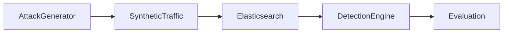

# Adversarial Lab

HB-IDS includes adversarial simulation modules.

## Supported Attacks

- DNS tunneling
- Slow beaconing
- Lateral movement
- Feature perturbation
- Load-based evasion

## Evaluation Metrics

- Detection Rate
- Attack Success Rate
- Detection Delay
- PR-AUC under attack
- Drift magnitude

## Attack Flow

