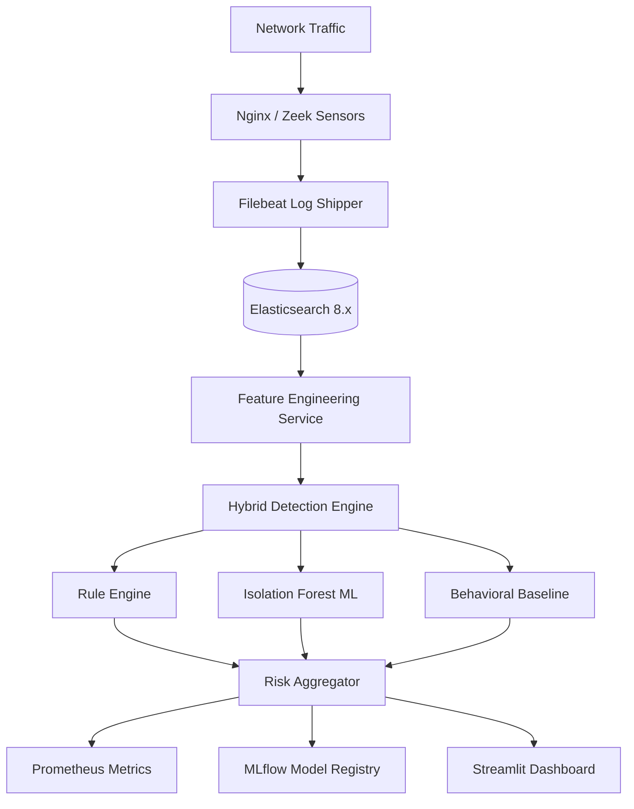

# Architecture Deep Dive

## System Layers

HB-IDS follows a six-layer detection architecture, designed for horizontal scalability and graceful degradation.



---

## Layer Details

### 1. Ingestion Layer

- **Nginx** serves as the target web application generating HTTP access logs
- **Filebeat** ships logs in real-time to Elasticsearch using structured JSON format
- Log fields: `timestamp`, `client_ip`, `method`, `path`, `status`, `response_time`, `bytes`

### 2. Storage Layer

- **Elasticsearch 8.x** stores all logs in `nginx-logs-*` index pattern
- Detection alerts written to `alerts-*` index
- Retention policy: 7 days (configurable)

### 3. Feature Engineering (`ml_engine/features.py`)

Engineered features extracted per time window:

| Feature | Description |
|---|---|
| `request_rate` | Requests per second in sliding window |
| `error_rate` | Ratio of 4xx/5xx responses |
| `unique_endpoints` | Count of distinct paths accessed |
| `payload_entropy` | Shannon entropy of request paths |
| `session_velocity` | Requests per session |
| `baseline_deviation` | Z-score vs. historical baseline |
| `byte_ratio` | Response bytes / request rate |

### 4. Hybrid Detection Engine (`detection_engine/`)

**Hybrid Risk Formula:**

```
Risk_Score = 0.3 × Rule_Score + 0.5 × ML_Score + 0.2 × Behavioral_Score
```

Thresholds:

- `Risk > 0.85` → CRITICAL alert
- `0.65 < Risk ≤ 0.85` → WARNING alert
- `Risk ≤ 0.65` → INFO / benign

### 5. Adaptive Detection (`detection_engine/adaptive_detection.py`)

- Monitors FPR per rule over time
- Adjusts thresholds using exponential moving average
- Prevents threshold creep during sustained attack campaigns

### 6. Observability Layer

- **Prometheus**: scrapes `/metrics` from detection engine every 15s
- **MLflow**: logs every training run — parameters, metrics, model artifact
- **Kibana**: log exploration and custom alert dashboards

---

## Scalability Design

- Detection services are **stateless** — all state in Elasticsearch
- Horizontal scaling: multiple detection engine instances reading from same ES index
- Prometheus-driven autoscaling triggers (HPA in Kubernetes)
- Filebeat handles backpressure with internal queue when ES is slow

---

## Data Retention & Storage Estimates

| Data Type | Volume | Retention |
|---|---|---|
| Nginx access logs | ~50KB/1000 req | 7 days |
| Detection alerts | ~2KB/alert | 30 days |
| ML model artifacts | ~5MB/model | All versions |
| Prometheus metrics | ~500B/sample | 15 days |
