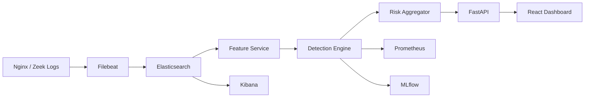

# System Architecture

HB-IDS follows a layered hybrid detection architecture.

## High-Level Overview

## Core Components

### 1. Ingestion Layer

* Filebeat collects logs
* Elasticsearch stores events

### 2. Feature Service

* Window aggregation
* DNS entropy calculation
* Port diversity
* Login anomaly metrics

### 3. Detection Engine

* Rule-based detection
* Isolation Forest baseline
* Behavioral confirmation
* Adaptive confidence weighting

### 4. Risk Aggregator

* Combines rule score + ML score
* Produces unified risk value

### 5. API Layer

* FastAPI
* WebSocket support
* JSON alert streaming

### 6. Frontend

* React + Tailwind
* Live dashboards
* Graph exploration
