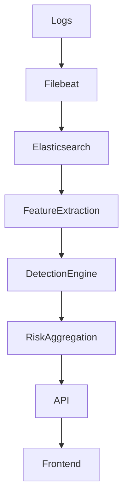
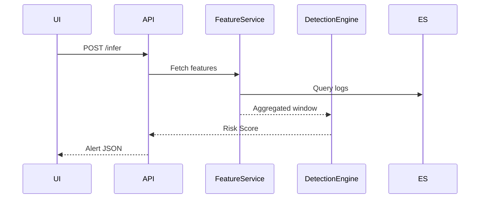

# Data Flow

## End-to-End Pipeline

```mermaid
flowchart TD
    Logs --> Filebeat
    Filebeat --> Elasticsearch
    Elasticsearch --> FeatureExtraction
    FeatureExtraction --> DetectionEngine
    DetectionEngine --> RiskAggregation
    RiskAggregation --> API
    API --> Frontend
```

## Inference Flow

```mermaid
sequenceDiagram
    participant UI
    participant API
    participant FeatureService
    participant DetectionEngine
    participant ES

    UI->>API: POST /infer
    API->>FeatureService: Fetch features
    FeatureService->>ES: Query logs
    FeatureService-->>DetectionEngine: Aggregated window
    DetectionEngine-->>API: Risk Score
    API-->>UI: Alert JSON
```
