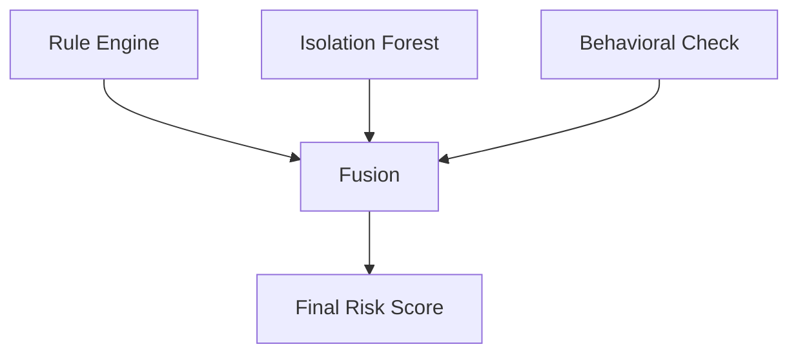

# Detection Engine

HB-IDS uses a hybrid detection stack.

## Components

### Rule Engine

- Signature-based detection
- Known threat patterns

### ML Engine

- Isolation Forest
- Anomaly score generation

### Behavioral Layer

- Temporal stability check
- Drift detection (PSI / KL divergence)

### Fusion Strategy

Final Score =  
Weighted(Rule Score, ML Score, Behavioral Confidence)

